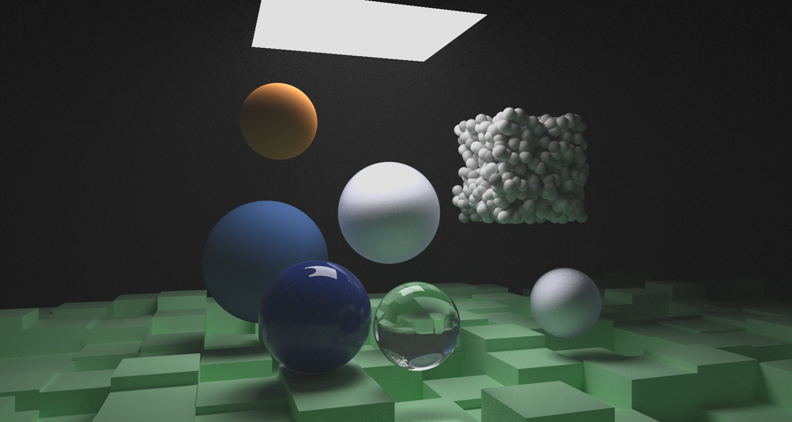
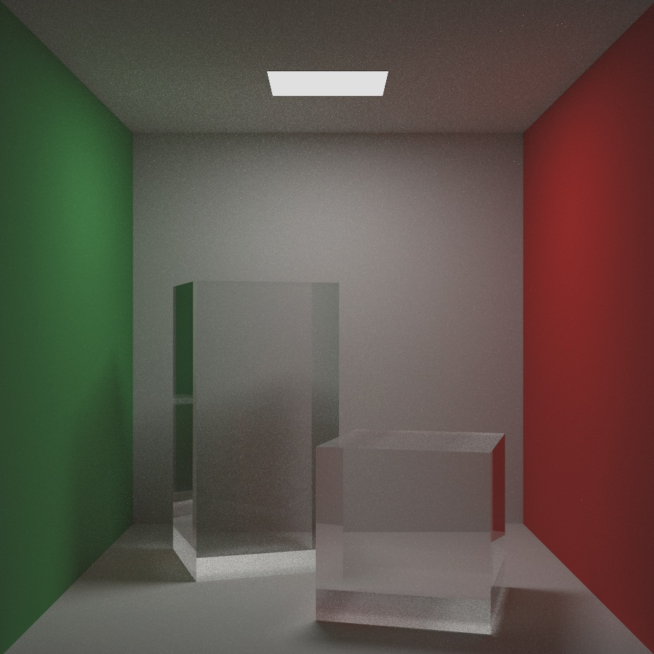
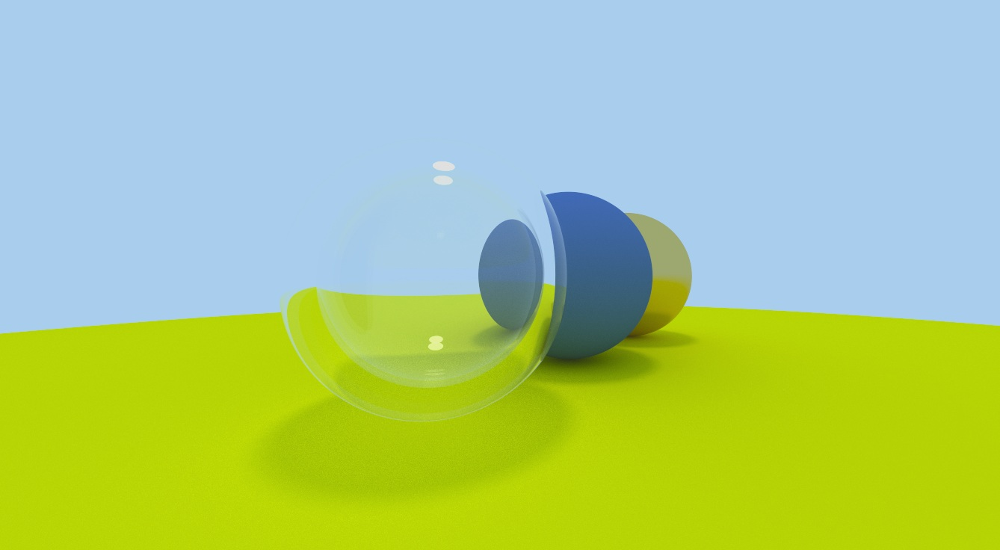

# Ray Tracing In One Weekend: DirectX Raytracing Edition

This repository implements all three "Ray Tracing In One Weekend" books by using simple DXR code written from the scratch, without any serious abstractions and without being based on complicated samples.

Before you continue, you should go through all three books, implement and understand them first. Now that you surely did it, let's go.

Code was based on this awesome blog entry from Laura:
https://landelare.github.io/2023/02/18/dxr-tutorial.html

If you want to learn pure DXR from scratch, above link is a must-read. It will help you build very basic DXR app that already looks cool. What I did on top of it, is I extended it to implement all three volumes of "Ray Tracing In One Weekend". During this work I did my best to keep it simple, keep it actually working (!) and resembling what was intented in the book.

## Disclaimer
This is not course on programming, design patterns nor clean code. For even a second do not consider this is production quality, this code is purely for purpose of learning the DXR and ray tracing basics and to be used as kind of easy-to-master playground while you are on beginning of your path-tracing learning journey, written under assumption that you want to have the ability to easily tamper with various mechanisms. In production, you would use a lot of abstractions to make proper development and maintenance much easier.

## Instructions
This code contains multiple scenes from the series. It is in the state where you are left when you finish the books, but you can see how "older" scenes are looking on "new" algorithms there. Also, every scene has at least single light added as I didn't make any lambertian/isomorphic PDF fallback to purely nonPDF shading version in case there are no lights at all (I leave this as an exercise if you want, it should be really easy - just check how the speculars are doing it).

To run, just buy some card with raytracing support (I did all of this on RTX2060), download the code, build the solution on VS2022, and... well... run.

You can change the scenes by using 'SPACE'.

In each scene, you can freely roam by using mouse and WASD.

You can use 'Z' to toggle the automatic samples per pixel so that app is always responsive. In manual mode, you can use 'X' (x2 samples) and 'C' (samples/2) to change the number of samples used.

You can use 'M' to toggle stratification, although I see like zero difference with it (maybe I have a bug, either in my eyes or in my code, who knows..).

Use 'ESC' to exit the app.

(Things that are not implemented as of now: textures and motion blur)

## You liked it? You can support me by buying me a coffee

## Samples

